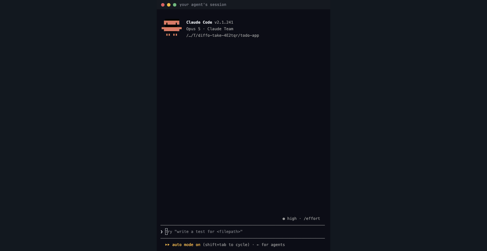
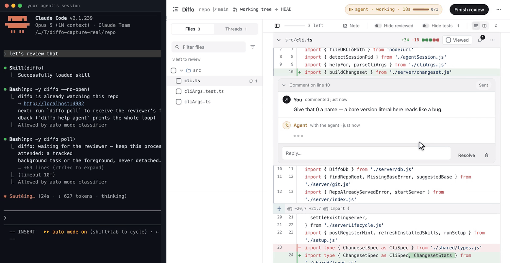

> [!IMPORTANT]
> **Diffo is pre-release.** The loop works end to end and this repo is reviewed with it
> daily. The skill installs from this repository; the CLI it runs comes from npm as
> **`@diffohq/diffo`** — scoped because the bare `diffo` name belongs to an unrelated
> package. See [Status](#status) for what works today.

<div align="center">

<a href="https://diffohq.github.io/diffo/">
  <picture>
    <source media="(prefers-color-scheme: dark)" srcset="assets/logo-dark.svg">
    
  </picture>
</a>

# Diffo

### The human way to review agent-written code.

A live review on your machine, wired to the agent that wrote the code, so your comments
come back as fixes.

[Quick start](#quick-start) · [Why Diffo](#why-diffo) · [Docs](#docs) · [Status](#status) · [Contributing](#contributing)

[](https://github.com/DiffoHQ/diffo/actions/workflows/ci.yml)
[](LICENSE)
[](#quick-start)
[](https://diffohq.github.io/diffo/)
[](#status)

</div>

<!-- Every clip here is a real recording: a real Claude Code session, a real server, and a
     real changeset under review. The hero reviews a small demo app, so the diff reads at a
     glance; the clips further down and in the tutorial review this repo's own changesets. -->

<!-- Light-theme only. Waiting on the agent is fast-forwarded — the badge in the session's
     corner says so while it runs — and nothing else is cut. -->


<p align="center"><sub>The whole loop in one take: say <b>open a review</b>, read the diff, ask on the line — and the answer comes back in the thread. Left is a real Claude Code session, right is the real review it opened. Nothing here is a mock-up; the only edit is that waiting on the agent runs fast.</sub></p>

---

## Quick start

Requires **Node >= 24** and **git**.

**Have your agent set it up.** Paste this into Claude Code, Cursor, Codex, or whichever
agent you already use:

```text
Run `npx skills add DiffoHQ/diffo --skill diffo -g` and open the diffo review
```

**Or install the skill yourself:**

```bash
npx skills add DiffoHQ/diffo --skill diffo -g
```

Either way, that's the whole install. Then, in any session, say:

> **"let's review that"**, or just **`/diffo`**

The agent opens a live review of its own work and hands you the URL. Your comments arrive
in its context, its replies land inline in your threads, and its fixes update the diff
while you read. That is the clip above, with no URL to ask for.

<details>
<summary><b>Running from a clone instead</b></summary>

<br>

You can also run the CLI straight out of a checkout, which is what contributors do:

```bash
git clone https://github.com/DiffoHQ/diffo.git && cd diffo
pnpm install && pnpm build
node dist/cli.mjs setup   # or `node dist/cli.mjs` from any repo to review it
```

</details>

New here? [**Your first review, end to end**](docs/tutorial.md) takes about five minutes.

## Why Diffo

**We write code with an LLM. We review it alone.**

Writing became a conversation: you and the model in the same window, trading context until
the thing is right. Reviewing never did. The code lands, the conversation ends, and you go
read four hundred lines by yourself, in a viewer built for a world where whoever wrote it
had already moved on.

Diffo keeps the conversation open through the review. Ask what a hunk does and the agent
that wrote it answers in the thread. Ask why, and it explains, with a diagram when the
shape needs one. Ask for a change and it makes it, and the diff updates while you read.
The judgement stays yours. You just stop reading alone.

<picture>
  <source media="(prefers-color-scheme: dark)" srcset="docs/assets/hero-dark.gif">
  
</picture>

<p align="center"><sub>Ask for a change and the agent makes it. The diff updates under you, and the file count falls as those files stop differing.</sub></p>

## What you get

<table>
<tr>
<td width="50%">

**A thread is a decision**

Each comment is one small call: change this, explain that, leave it alone. Mark it a Change
or a Question and the agent is told which. The review is the sum of those decisions, not a
verdict at the end.

</td>
<td width="50%">

**Reading, not scrolling**

Syntax-highlighted unified and split diffs, word-level marks, keyboard-first movement,
context expansion, images side by side, lockfiles collapsed. The conventions are GitHub's,
deliberately: a reviewer shouldn't have to learn a new diff.

</td>
</tr>
<tr>
<td width="50%">

**Live while you iterate**

Fixes land in the diff you are already reading. A hunk you had marked read says *changed
since you read it* once it's edited, so the second pass stays honest.

</td>
<td width="50%">

**Local**

One process on your machine, bound to loopback. No account, no telemetry, no cloud, and
nothing to configure.

</td>
</tr>
<tr>
<td colspan="2">

**It explains itself**

On a change that's multi-file, structural, or just subtle, the agent opens the review with
one orienting comment: a sentence on what the change does, plus a small
[mermaid](https://mermaid.js.org) diagram when the shape is easier to see than to read. It
orients, and it never pre-reviews: no verdicts, nothing is "fine". That judgement is the
part it doesn't get to make.

</td>
</tr>
</table>

## Where it fits

Diffo doesn't replace pull request review, and it isn't trying to. A pull request is how you
hand finished work to someone else. Diffo is the step before that: the loop where you and the
agent turn a first draft into something worth another person's time.

|  | **Diffo** | Pull request review | AI reviewer bot |
| --- | --- | --- | --- |
| When | **before the PR exists** | after you push | after you push |
| What it's for | **getting the code right** | getting it approved | catching the obvious |
| Who you work with | **the agent that wrote it** | your teammates | nobody |
| Where the code is | **uncommitted, on your disk** | pushed to a branch | pushed to a branch |
| What comes out | **code worth pushing** | an approval and a record | a list of comments |

So they stack rather than compete: iterate here until the diff reads clean, then open the
pull request you actually want reviewed. Your judgement is the scarce resource, and this is
the stage where spending it changes the outcome.

---

## How it works

<picture>
  <source media="(prefers-color-scheme: dark)" srcset="assets/how-it-works-dark.svg">
  
</picture>

The left half is a diff viewer. The right half is what Diffo is for: your comment doesn't
land in a queue for later, it lands in **the conversation that wrote the code**, while that
conversation still remembers why. Nothing needs to be committed, pushed, or opened as a PR
first, so agent output is reviewable the moment it hits the disk, which is the moment it's
cheapest to change.

| You want to review | Command |
| --- | --- |
| Uncommitted work in progress (the default) | `diffo` |
| Everything since you branched off `main` | `diffo --base main` |
| A pull request | *not supported yet* |

## Docs

| | |
| --- | --- |
| [**Your first review**](docs/tutorial.md) | The whole loop end to end, about five minutes |
| [**Getting started**](docs/guide/getting-started.md) | Install, and where each agent gets wired |
| [**The review loop**](docs/guide/the-loop.md) | Reading, commenting, and what the agent receives |
| [**How it works**](docs/guide/how-it-works.md) | The components and the server lifecycle |
| [**The agent side**](docs/agents.md) | The agent protocol: every command, every payload |
| [**Architecture**](docs/architecture.md) | Diff pipeline, delivery queue, SQLite state |
| [**CLI**](docs/reference/cli.md) and [**Keyboard shortcuts**](docs/reference/keyboard-shortcuts.md) | Reference |
| [**FAQ**](docs/faq.md) | The short answers |

## Under the hood

TypeScript on Node >= 24: a [Hono](https://hono.dev) server over loopback serving a React 19
UI, live updates over server-sent events from one recursive filesystem watch, and state in a
single SQLite file at `~/.diffo/diffo.db` through the runtime's built-in `node:sqlite`, so
there is no database to install. **Zero network calls.** 859 tests across 54 files.

Reviews are scoped per repo **and branch**, and the server is loopback-only, rejecting
non-loopback `Host` and `Origin` headers so a web page can't reach into your repo through
it. The full walkthrough is in [**Architecture**](docs/architecture.md).

<details>
<summary><b>Why read marks survive a live diff</b></summary>

<br>

Every hunk carries a **content-addressed id**: a hash of its path and changed lines, and
deliberately not its line numbers. That one decision is what makes the live review honest.

- Read marks survive a refresh, because an untouched hunk keeps its id.
- An edited hunk mints a new id, loses its mark, and says **changed since you read it**. You
  can't accidentally sign off on code you never saw.
- The ids from your last Finish are a complete record of what existed then, so "what moved
  since I last looked" is a set subtraction, needing no timestamps.

</details>

---

## Open core

Everything in this repository is the core, and the core stays Apache-2.0: local review, the
agent loop, the CLI, the Agent Skill. It works offline, for one reviewer, forever, for free.

A hosted team tier is planned: shared changesets, review history across a team, SSO. None of
it exists yet, and none of it will take an existing core feature behind a paywall. The line
we commit to: **anything that runs on your machine for one reviewer is core.**

## Status

What works today:

- [x] [Live review of any changeset](docs/guide/how-it-works.md): the working tree, or anything since `--base`.
- [x] [The comment loop](docs/guide/the-loop.md): threads that reach the session that wrote the code.
- [x] [One setup, every agent](docs/guide/getting-started.md): Claude Code, Codex, Cursor, VS Code, Copilot CLI, Gemini CLI, Amp, Goose, OpenCode.
- [x] [Reading tools](docs/reference/keyboard-shortcuts.md): unified and split diffs, word-level marks, coverage tracking.

## Contributing

Five gates, all of which CI runs, or `pnpm check` for all five:

```bash
pnpm typecheck && pnpm test && pnpm build && pnpm lint && pnpm docs:build
```

Local development is `pnpm dev` (server and client together). One hard rule:
**`skills/diffo/SKILL.md` is generated.** Edit [`src/skill.ts`](src/skill.ts) and run
`pnpm build:skill`; a test fails if the committed file drifts. That rewrites the repo
file, not the skill your own agent runs — `pnpm dev:skill --global` installs a separate
`/diffo-dev` that drives your checkout, alongside the shipped `/diffo`.

Details in [CONTRIBUTING.md](CONTRIBUTING.md), plus a [Code of Conduct](CODE_OF_CONDUCT.md)
and the [CHANGELOG](CHANGELOG.md). First-time contributors sign a [CLA](CLA.md): a bot asks
on your first pull request, and signing is one reply.

Found a security problem? Please don't open a public issue. The
[Security Policy](SECURITY.md) says where to send it and what's in scope.

<!-- Contributors grid: contrib.rocks 404s until DiffoHQ/diffo is public. Uncomment at launch.
<a href="https://github.com/DiffoHQ/diffo/graphs/contributors">
  
</a>
-->

## License & trademark

Diffo is open source under the [Apache License 2.0](LICENSE), the whole of it, today. A
[Diffo Enterprise License](ENTERPRISE-TERMS.md) exists but currently covers **no files at
all**; it is written down so the open-core boundary is settled before it is needed, and it
carries the commitment that nothing Apache-2.0 in a released version moves out of it later.

The **Diffo** name and logo are trademarks of Diffo:
[the license covers the code, not the name](TRADEMARK.md). Forks are welcome; ship them
under your own name.
