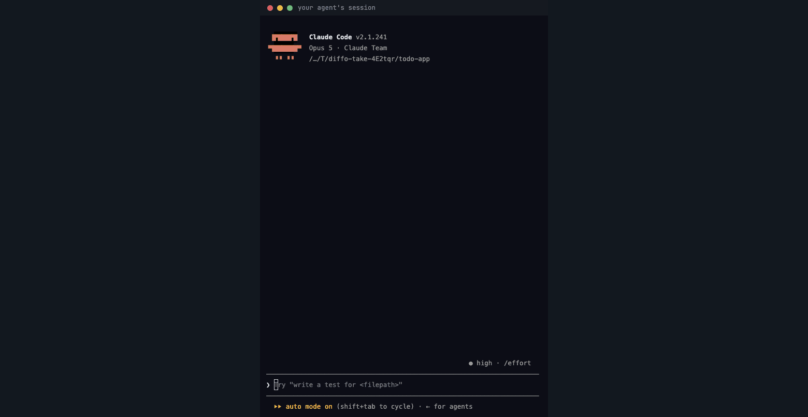
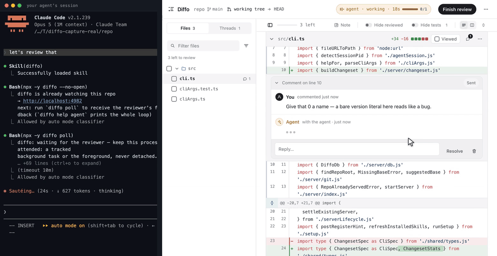
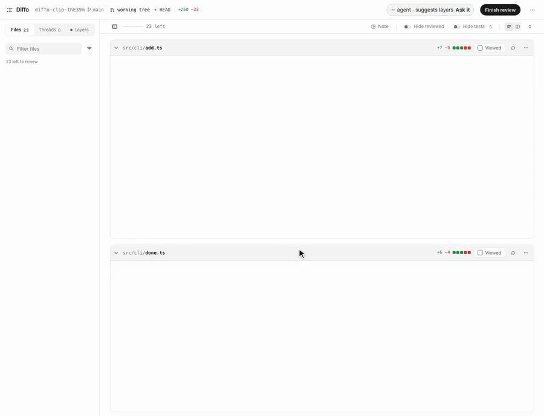

<div align="center">

<a href="https://diffohq.github.io/diffo/">
  <picture>
    <source media="(prefers-color-scheme: dark)" srcset="assets/logo-dark.svg">
    
  </picture>
</a>

# Diffo

### The human way to review agent-written code.

A live review on your machine. Read what your agent just wrote, with the session that
wrote it; or read a pull request with your agent beside you, and send your review to
GitHub.

[Quick start](#quick-start) · [What you can review](#what-you-can-review) · [Why Diffo](#why-diffo) · [Docs](#docs) · [Status](#status) · [Contributing](#contributing)

[](https://github.com/DiffoHQ/diffo/actions/workflows/ci.yml)
[](https://www.npmjs.com/package/@diffohq/diffo)
[](LICENSE)
[](#quick-start)
[](https://diffohq.github.io/diffo/)
[](#contributing)

</div>

<!-- Every clip here is a real recording: a real Claude Code session, a real server, and a
     real changeset under review. The hero and the pull request clip review a small demo
     app, so the diff reads at a glance; the others, and the tutorial, review this repo's
     own changesets. -->

<!-- Light-theme only. The clip opens once the session has finished writing the change:
     waiting on the agent is fast-forwarded — the badge in the session's corner says so
     while it runs — and nothing else is cut. -->


<p align="center"><sub>The whole loop in one take: type <code>/diffo</code>, read the diff, ask on the line, and the answer comes back in the thread. Left is a real Claude Code session, right is the real review it opened. Nothing here is a mock-up; the only edit is that waiting on the agent runs fast.</sub></p>

---

## Quick start

Requires **Node >= 24** and **git**.

**Have your agent set it up.** Paste this into Claude Code, Cursor, Codex, or whichever
agent you already use:

```text
Run `npx skills add DiffoHQ/diffo --skill diffo -g` and open the diffo review
```

**Or install the skill yourself:**

```bash
npx skills add DiffoHQ/diffo --skill diffo -g
```

Either way, that's the whole install. Then, in any session, say:

> **"let's review that"**, or just **`/diffo`**

The agent opens a live review of its own work and hands you the URL. Your comments arrive
in its context, its replies land inline in your threads, and its fixes update the diff
while you read. That is the clip above, with no URL to ask for.

Or hand it a pull request:

> **`/diffo https://github.com/acme/widgets/pull/482`**

It checks the PR out in a worktree of its own, opens the review, and reads beside you;
your review goes back to GitHub when you finish. This one needs the
[GitHub CLI](https://cli.github.com) signed in.

<details>
<summary><b>Running from a clone instead</b></summary>

<br>

You can also run the CLI straight out of a checkout, which is what contributors do:

```bash
git clone https://github.com/DiffoHQ/diffo.git && cd diffo
pnpm install && pnpm build
node dist/cli.mjs setup   # or `node dist/cli.mjs` from any repo to review it
```

</details>

New here? [**Your first review, end to end**](https://diffohq.github.io/diffo/tutorial) takes about five minutes.

## What you can review

One command, three targets. In your agent's session it's `/diffo …`; in a terminal it's
`diffo …`, or `npx -y @diffohq/diffo …` with nothing installed.

| You want to review | In your agent | In a terminal |
| --- | --- | --- |
| What the agent just wrote: the working tree, untracked files included | `/diffo` | `diffo` |
| Everything since you branched off `main` | `/diffo main` | `diffo main` |
| A GitHub pull request | `/diffo <PR link>` | `diffo <PR URL>` |

From a clone of its repo, a pull request also goes by `acme/widgets#482`, `#482`, or
just `482`.

Around the review:

| | |
| --- | --- |
| `diffo status` | Is a server watching this repo, and where |
| `diffo stop` | Stop it. The review survives; the next `diffo` picks it back up |
| `diffo clean` | Remove the worktrees Diffo made for pull requests whose review is over |
| `diffo setup` | Register Diffo with every coding agent on this machine, not just the one you installed the skill from |

The agent's side is five commands, `poll`, `reply`, `comment`, `layers` and `end`, and the
skill teaches them. The [**CLI reference**](https://diffohq.github.io/diffo/reference/cli)
has every flag.

## Why Diffo

**We write code with an LLM. We review it alone.**

Writing became a conversation: you and the model in the same window, trading context until
the thing is right. Reviewing never did. The code lands, the conversation ends, and you go
read four hundred lines by yourself, in a viewer built for a world where whoever wrote it
had already moved on.

Diffo keeps the conversation open through the review. Ask what a hunk does and the agent
answers in the thread. Ask why, and it explains, with a diagram when the shape needs one.
Ask for a change and it makes it, and the diff updates while you read. The judgement stays
yours. You just stop reading alone.

<picture>
  <source media="(prefers-color-scheme: dark)" srcset="docs/assets/hero-dark.gif">
  
</picture>

<p align="center"><sub>Ask for a change and the agent makes it. The diff updates under you, and the file count falls as those files stop differing.</sub></p>

## Review what your agent wrote

The default. `diffo` reviews the working tree against `HEAD`, so agent output is
reviewable the moment it hits the disk, which is the moment it's cheapest to change.
Nothing is committed, pushed, or opened as a PR first.

- **A thread is a decision.** Each comment is one small call: change this, explain that,
  leave it alone. Drop it on a line or drag down the gutter for a range of them. Mark it a
  **Change** or a **Question** and the agent is told which, so a question never turns into
  an unrequested refactor.
- **Fixes land in the diff you're reading.** A Change gets the edit, live, under your
  cursor. A hunk you had marked read says *changed since you read it* once it's edited, so
  the second pass stays honest.
- **It explains itself.** On a change that's multi-file, structural, or just subtle, the
  agent opens the review with one orienting comment: what the change does, plus a small
  [mermaid](https://mermaid.js.org) diagram when the shape is easier to see than to read.
  It orients, and it never pre-reviews: no verdicts, nothing is "fine". That judgement is
  the part it doesn't get to make.
- **Send one, or finish the batch.** *Send to agent* delivers a thread now. *Finish
  review* hands the whole batch back with honest coverage stats attached ("38/42 hunks
  viewed, 2 files skipped").
- **Reading, not scrolling.** Syntax-highlighted unified and split diffs, word-level marks,
  keyboard-first movement, context expansion, images side by side, lockfiles collapsed.
  The conventions are GitHub's, deliberately: a reviewer shouldn't have to learn a new
  diff.

## Read it in layers

A diff arrives alphabetically, which is almost never the order to read it in. Ask, and the
agent posts **layers**: the change as ordered steps, each with a title, a summary, and its
files. You read one layer at a time; `]` steps to the next. Anything the agent touches after
posting gathers in a *Since your review* layer, so nothing hides outside the plan. Layers
come from the agent only; Diffo never guesses a plan from paths.

<picture>
  <source media="(prefers-color-scheme: dark)" srcset="docs/assets/layers-dark.gif">
  
</picture>

<p align="center"><sub>Layers, in one take: the agent offers an outline, the reviewer asks, and a 23-file change arrives as eight steps to read in order. Three layers in, a question on a line comes back answered in the thread. A real server and a real <code>diffo poll</code> on the other end; only the agent's thinking time is cut.</sub></p>

## Review a pull request

When a pull request lands on *your* desk, `/diffo <PR link>` opens it in the same review,
with your agent beside you as a copilot for code it did not write.

- **Your checkout is never touched.** The PR is fetched into a worktree Diffo owns, under
  `~/.diffo/worktrees`, and the review opens there: no branch switch, no stash, nothing in
  `git status`. `diffo clean` removes it once the review is over.
- **The conversation comes with it.** The description is the review's overview, inline
  GitHub threads sit at their lines with the real logins, and the header carries the PR's
  state: draft, CI failing, changes requested. A push moves the review to the new head.
- **Two kinds of comment.** Every composer has two tabs. **Comment on PR** goes to the
  author and reviewers, as one review when you finish. **Ask agent** goes to your agent,
  on this machine, and never leaves it: the agent can run the tests in the worktree and
  answer with evidence, and it never posts to GitHub. When the answer is a fix, it comes as
  a ```` ```suggestion ```` block rather than an edit to code that isn't its own.
- **Submit from Diffo.** *Submit review* is GitHub's own dialog: a body, a verdict
  (Comment, Approve, Request changes), then one review posted through your own `gh`.
  Diffo holds no token, and this is the only time it touches the network: that PR's
  GitHub host, and nothing else.

<!-- Light-theme only, like the hero. The pull request is a real one on a demo repo
     (DiffoHQ/todo-demo#1), and the review at the end is the one this take submitted. -->


<p align="center"><sub>A pull request, end to end: <code>/diffo &lt;PR link&gt;</code>, read it in layers, ask your agent on a line, leave a comment for the author, and submit to GitHub. A real Claude Code session and a real pull request; the only edit is that waiting on the agent runs fast.</sub></p>

## Where it fits

Diffo isn't an AI reviewer. It doesn't grade your diff or leave generated nitpicks: you
read, and the agent is there to answer, explain, and fix. That's the difference from a
bot, and from reading a pull request on your own.

|  | **Diffo** | AI reviewer bot | Plain pull request review |
| --- | --- | --- | --- |
| Who reads the code | **you** | a model | you |
| Who answers your questions | **the agent, in the thread, now** | nobody | the author, when they get to it |
| When | **while the agent writes, or when the PR lands** | after you push | after you push |
| What comes out | **fixes in the diff, or a review on GitHub** | a list of comments | a review on GitHub |

So it stacks with the pull request rather than competing: iterate locally until the diff
reads clean, open the PR, and read the ones that land on your desk the same way. Your
judgement is the scarce resource, and this is the tool for spending it where it changes
the outcome.

---

## How it works

<picture>
  <source media="(prefers-color-scheme: dark)" srcset="assets/how-it-works-dark.svg">
  
</picture>

The left half is a diff viewer. The right half is what Diffo is for: your comment doesn't
land in a queue for later, it lands in **the agent's session**, live. For your own work
that is the session that wrote the code, while it still remembers why; for a pull request,
the one you invited to read beside you. One npm package, one process per repo, bound to
loopback: no account, no telemetry, no cloud, and no model API. Diffo spawns no agents of
its own; the one you're already talking to stays attached through `diffo poll`.

## Docs

| | |
| --- | --- |
| [**Your first review**](https://diffohq.github.io/diffo/tutorial) | The whole loop end to end, about five minutes |
| [**Getting started**](https://diffohq.github.io/diffo/guide/getting-started) | Install, and where each agent gets wired |
| [**The review loop**](https://diffohq.github.io/diffo/guide/the-loop) | Reading, layers, commenting, and what the agent receives |
| [**Reviewing a pull request**](https://diffohq.github.io/diffo/guide/pr-review) | A GitHub PR in a worktree, your agent beside you, your review back on GitHub |
| [**How it works**](https://diffohq.github.io/diffo/guide/how-it-works) | The components and the server lifecycle |
| [**The agent side**](https://diffohq.github.io/diffo/agents) | The agent protocol: every command, every payload |
| [**Architecture**](https://diffohq.github.io/diffo/architecture) | Diff pipeline, delivery queue, SQLite state |
| [**CLI**](https://diffohq.github.io/diffo/reference/cli) and [**Keyboard shortcuts**](https://diffohq.github.io/diffo/reference/keyboard-shortcuts) | Reference |
| [**FAQ**](https://diffohq.github.io/diffo/faq) | The short answers |

## Under the hood

TypeScript on Node >= 24: a [Hono](https://hono.dev) server over loopback serving a React 19
UI, live updates over server-sent events from one recursive filesystem watch, and state in a
single SQLite file at `~/.diffo/diffo.db` through the runtime's built-in `node:sqlite`, so
there is no database to install. **No network calls of its own**: a pull request review
talks to GitHub only through your `gh`. 1,327 tests across 70 files.

Reviews are scoped per repo **and branch**, and the server is loopback-only, rejecting
non-loopback `Host` and `Origin` headers so a web page can't reach into your repo through
it. The full walkthrough is in [**Architecture**](https://diffohq.github.io/diffo/architecture).

<details>
<summary><b>Why read marks survive a live diff</b></summary>

<br>

Every hunk carries a **content-addressed id**: a hash of its path and changed lines, and
deliberately not its line numbers. That one decision is what makes the live review honest.

- Read marks survive a refresh, because an untouched hunk keeps its id.
- An edited hunk mints a new id, loses its mark, and says **changed since you read it**. You
  can't accidentally sign off on code you never saw.
- The ids from your last Finish are a complete record of what existed then, so "what moved
  since I last looked" is a set subtraction, needing no timestamps.

</details>

---

## Open core

Everything in this repository is the core, and the core stays Apache-2.0: local review, the
agent loop, pull request review, the CLI, the Agent Skill. It works offline, for one
reviewer, forever, for free.

A hosted team tier is planned: shared changesets, review history across a team, SSO. None of
it exists yet, and none of it will take an existing core feature behind a paywall. The line
we commit to: **anything that runs on your machine for one reviewer is core.**

## Status

Diffo is pre-1.0: everything below works end to end (this repo is reviewed with it
daily) and the edges are still moving. What works today:

- [x] [Live review of any changeset](https://diffohq.github.io/diffo/guide/how-it-works): the working tree, or anything since `--base`.
- [x] [Pull request review](https://diffohq.github.io/diffo/guide/pr-review): `diffo <PR URL>` reviews a GitHub PR in a worktree of its own, with the conversation imported and your review submitted from Diffo.
- [x] [The comment loop](https://diffohq.github.io/diffo/guide/the-loop): threads that reach the session that wrote the code, or the one reading beside you.
- [x] [Layers](https://diffohq.github.io/diffo/guide/the-loop#read-it-in-layers): the agent's reading plan, one ordered step at a time.
- [x] [One setup, every agent](https://diffohq.github.io/diffo/guide/getting-started): Claude Code, Codex, Cursor, VS Code, Copilot CLI, Gemini CLI, Amp, Goose, OpenCode.
- [x] [Reading tools](https://diffohq.github.io/diffo/reference/keyboard-shortcuts): unified and split diffs, word-level marks, coverage tracking.

## Contributing

Five gates, all of which CI runs, or `pnpm check` for all five:

```bash
pnpm typecheck && pnpm test && pnpm build && pnpm lint && pnpm docs:build
```

Local development is `pnpm dev` (server and client together). One hard rule:
**`skills/diffo/SKILL.md` is generated.** Edit [`src/skill.ts`](src/skill.ts) and run
`pnpm build:skill`; a test fails if the committed file drifts. That rewrites the repo
file, not the skill your own agent runs; `pnpm dev:skill --global` installs a separate
`/diffo-dev` that drives your checkout, alongside the shipped `/diffo`.

Details in [CONTRIBUTING.md](CONTRIBUTING.md), plus a [Code of Conduct](CODE_OF_CONDUCT.md)
and the [CHANGELOG](CHANGELOG.md). First-time contributors sign a [CLA](CLA.md): a bot asks
on your first pull request, and signing is one reply.

Found a security problem? Please don't open a public issue. The
[Security Policy](SECURITY.md) says where to send it and what's in scope.

<a href="https://github.com/DiffoHQ/diffo/graphs/contributors">
  
</a>

## License & trademark

Diffo is open source under the [Apache License 2.0](LICENSE), the whole of it, today. A
[Diffo Enterprise License](ENTERPRISE-TERMS.md) exists but currently covers **no files at
all**; it is written down so the open-core boundary is settled before it is needed, and it
carries the commitment that nothing Apache-2.0 in a released version moves out of it later.

The **Diffo** name and logo are trademarks of Diffo:
[the license covers the code, not the name](TRADEMARK.md). Forks are welcome; ship them
under your own name.
