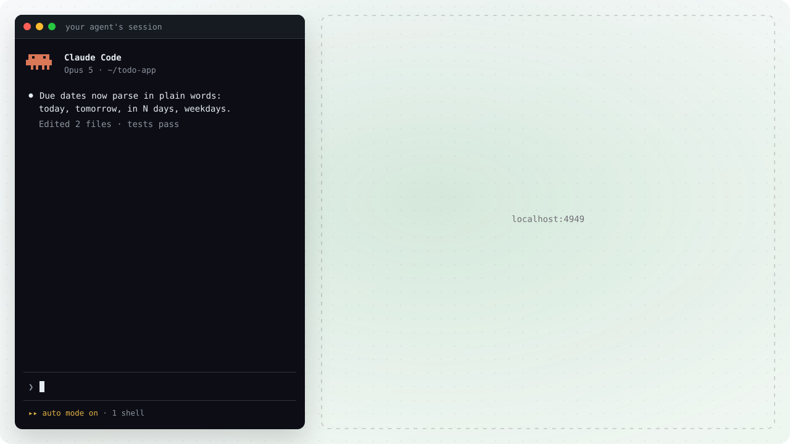

<div align="center">

<a href="https://diffohq.github.io/diffo/">
  <picture>
    <source media="(prefers-color-scheme: dark)" srcset="assets/readme-hero-dark.svg">
    
  </picture>
</a>

Ask your agent for a review. You get the change in **layers**, in the order it should be
read, and **the agent on the other end of every comment**: it answers on the line and fixes
while you read. Hand it a pull request instead, and it reads beside you and sends your
review to GitHub.

[Quick start](#quick-start) · [The conversation](#talk-to-the-agent-on-the-line) · [Layers](#read-it-in-layers) · [Pull requests](#review-a-pull-request) · [Docs](#docs) · [Contributing](#contributing)

[](https://github.com/DiffoHQ/diffo/actions/workflows/ci.yml)
[](https://www.npmjs.com/package/@diffohq/diffo)
[](LICENSE)
[](https://diffohq.github.io/diffo/)

</div>

<picture>
  <source media="(prefers-color-scheme: dark)" srcset="assets/readme-demo-dark.svg">
  
</picture>

<p align="center"><sub>The whole loop: type <code>/diffo</code>, ask on the line, and the answer and the fix come back into the diff you're reading. Drawn, so it stays sharp; <a href="#talk-to-the-agent-on-the-line">the real, unedited take</a> is below.</sub></p>

---

## Quick start

Requires **Node >= 24** and **git**. Paste this into Claude Code, Cursor, Codex, or
whichever agent you already use:

```text
Run `npx skills add DiffoHQ/diffo --skill diffo -g` and open the diffo review
```

That's the whole install. From then on, one command in any session:

| Run | And the agent reviews |
| --- | --- |
| `/diffo` | what it just wrote, before anything is committed |
| `/diffo main` | everything since you branched off `main` |
| `/diffo <PR link>` | a GitHub pull request, checked out in a worktree of its own; your review goes back to GitHub when you finish |

Every time, the agent opens the review and hands you the URL. It all runs on your
machine, and nothing needs to be committed or pushed first. A pull request needs the
[GitHub CLI](https://cli.github.com) signed in. Otherwise the only thing that leaves your
machine is two small anonymous usage events per review, [listed in full](https://diffohq.github.io/diffo/telemetry)
and off with `diffo telemetry off`.

New here? [**Your first review, end to end**](https://diffohq.github.io/diffo/tutorial) takes about five minutes.

## Talk to the agent on the line

**We write code with an LLM. We review it alone.**

Writing became a conversation: you and the model in the same window, trading context until
the thing is right. Reviewing never did. The code lands, the conversation ends, and you go
read four hundred lines by yourself, in a viewer built for a world where whoever wrote it
had already moved on.

Diffo keeps the conversation open through the review. The judgement stays yours. You just
stop reading alone.

<!-- Every clip here is a real recording: a real Claude Code session, a real server, and a
     real changeset under review. The hero and the pull request clip review a small demo
     app, so the diff reads at a glance; the layers clip, and the tutorial, review this
     repo's own changesets. -->

<!-- Light-theme only. The clip opens once the session has finished writing the change:
     waiting on the agent is fast-forwarded — the badge in the session's corner says so
     while it runs — and nothing else is cut. -->


<p align="center"><sub>The same loop, for real, in one take: type <code>/diffo</code>, read the diff, ask on the line, and the answer comes back in the thread. Left is a real Claude Code session, right is the real review it opened. Nothing here is a mock-up; the only edit is that waiting on the agent runs fast.</sub></p>

- **Ask on any line.** The agent that wrote the code answers in the thread, with a
  diagram when the shape needs one. Mark a thread a **Question** and it explains; mark it
  a **Change** and it edits, so a question never turns into an unrequested refactor.
- **Fixes land in the diff you're reading.** The diff updates under your cursor, and a
  hunk you had already read says *changed since you read it*, so the second pass stays
  honest.
- **A map, not a verdict.** On a multi-file or subtle change the agent opens the review
  with one orienting comment on what the change does. It never pre-reviews: no verdicts,
  nothing is "fine". That judgement is the part it doesn't get to make.
## Read it in layers

A diff arrives alphabetically, which is almost never the order to read it in. Ask, and the
agent posts **layers**: the change as ordered steps, each with a title, a summary, and its
files. You read one layer at a time, in the order the agent would explain it; `]` steps to
the next. Anything the agent touches after posting gathers in a *Since your review* layer,
so nothing hides outside the plan.

<picture>
  <source media="(prefers-color-scheme: dark)" srcset="docs/assets/layers-dark.gif">
  
</picture>

<p align="center"><sub>Layers, in one take: the agent offers an outline, the reviewer asks, and a 23-file change arrives as eight steps to read in order. Three layers in, a question on a line comes back answered in the thread. Only the agent's thinking time is cut.</sub></p>

## Review a pull request

When a pull request lands on *your* desk, give your agent the link. It checks the PR out
in a worktree of its own, so your checkout is never touched, and opens it as the same
review: the description and the GitHub threads come with it, and the agent reads beside
you as a copilot for code it did not write. Every comment has two tabs. **Comment on PR**
goes to the author, as one review when you finish. **Ask agent** stays on your machine:
the agent can run the tests and answer with evidence, and it never posts to GitHub.

<!-- Light-theme only, like the hero. The pull request is a real one on a demo repo
     (DiffoHQ/todo-demo#1), and the review at the end is the one this take submitted. -->


<p align="center"><sub>A pull request, end to end: hand over the link, read it in layers, ask your agent on a line, leave a comment for the author, and submit to GitHub. A real Claude Code session and a real pull request; the only edit is that waiting on the agent runs fast.</sub></p>

## Where it fits

Diffo isn't an AI reviewer. It doesn't grade your diff or leave generated nitpicks: you
read, and the agent is there to answer, explain, and fix.

|  | **Diffo** | AI reviewer bot | Plain pull request review |
| --- | --- | --- | --- |
| Who reads the code | **you** | a model | you |
| Who answers your questions | **the agent, in the thread, now** | nobody | the author, when they get to it |
| When | **while the agent writes, or when the PR lands** | after you push | after you push |
| What comes out | **fixes in the diff, or a review on GitHub** | a list of comments | a review on GitHub |

## How it works

<picture>
  <source media="(prefers-color-scheme: dark)" srcset="assets/how-it-works-dark.svg">
  
</picture>

One process on your machine, bound to loopback: no account, no cloud, and no model API.
The one thing it reports is [anonymous usage data](https://diffohq.github.io/diffo/telemetry),
two events per review, never code or paths, off with one command. Diffo spawns no agents
of its own; the one you're already talking to stays attached through the `diffo` CLI, so
your comments land in the session that holds the context. The viewer itself is a real diff viewer, unified and split, keyboard-first, with
GitHub's conventions. The CLI, the flags, and everything under the hood are in the docs.

## Docs

| | |
| --- | --- |
| [**Your first review**](https://diffohq.github.io/diffo/tutorial) | The whole loop end to end, about five minutes |
| [**Getting started**](https://diffohq.github.io/diffo/guide/getting-started) | Install, and where each agent gets wired |
| [**The review loop**](https://diffohq.github.io/diffo/guide/the-loop) | Reading, commenting, and what the agent receives |
| [**Layers**](https://diffohq.github.io/diffo/guide/layers) | The agent's reading plan: ordered steps, one at a time |
| [**Reviewing a pull request**](https://diffohq.github.io/diffo/guide/pr-review) | A GitHub PR in a worktree, your agent beside you, your review back on GitHub |
| [**How it works**](https://diffohq.github.io/diffo/guide/how-it-works) | The components and the server lifecycle |
| [**The agent side**](https://diffohq.github.io/diffo/agents) | The agent protocol: every command, every payload |
| [**Architecture**](https://diffohq.github.io/diffo/architecture) | Diff pipeline, delivery queue, SQLite state |
| [**CLI**](https://diffohq.github.io/diffo/reference/cli) and [**Keyboard shortcuts**](https://diffohq.github.io/diffo/reference/keyboard-shortcuts) | Reference |
| [**FAQ**](https://diffohq.github.io/diffo/faq) | The short answers |

## Open core

Everything in this repository is the core, and the core stays Apache-2.0: local review, the
agent loop, pull request review, the CLI, the Agent Skill. It works offline, for one
reviewer, forever, for free. A hosted team tier is planned, and none of it will take an
existing core feature behind a paywall: **anything that runs on your machine for one
reviewer is core.**

## Contributing

Diffo is pre-1.0: this repo is reviewed with it daily, and the edges are still moving.
`pnpm check` runs the five gates CI runs. One hard rule: **`skills/diffo/SKILL.md` is
generated** from [`src/skill.ts`](src/skill.ts); edit the source and run `pnpm build:skill`.
[CONTRIBUTING.md](CONTRIBUTING.md) has the rest, with a [Code of Conduct](CODE_OF_CONDUCT.md),
the [CHANGELOG](CHANGELOG.md), and the [CLA](CLA.md) a bot asks first-time contributors to
sign, in one reply.

Found a security problem? Please don't open a public issue. The
[Security Policy](SECURITY.md) says where to send it and what's in scope.

<a href="https://github.com/DiffoHQ/diffo/graphs/contributors">
  
</a>

## License & trademark

Diffo is open source under the [Apache License 2.0](LICENSE), the whole of it, today. A
[Diffo Enterprise License](ENTERPRISE-TERMS.md) exists but currently covers **no files at
all**; it is written down so the open-core boundary is settled before it is needed, and it
carries the commitment that nothing Apache-2.0 in a released version moves out of it later.

The **Diffo** name and logo are trademarks of Diffo:
[the license covers the code, not the name](TRADEMARK.md). Forks are welcome; ship them
under your own name.
