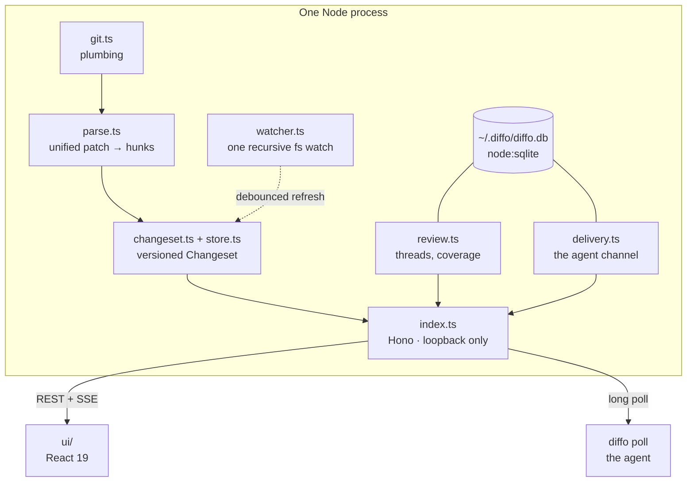

# Architecture

One npm package, one process, no services. `src/` splits three ways: `cli` + `server`
(Node), `ui` (browser), `shared` (the wire model both sides import).



## The diff pipeline

`git.ts` → `parse.ts` → `changeset.ts` → `ChangesetStore`.

**`git.ts`** shells out to git and nothing else. It resolves the base ref (`merge-base`
for a `--base` spec), reads the raw diff, collects staged paths, and synthesises diffs for
untracked files so brand-new agent output shows up as an addition rather than not at all.
It also serves single-file bytes for the image differ.

**`parse.ts`** parses the unified patch by hand rather than pulling a dependency. Two
details are load-bearing:

- The `@@` header's declared counts are authoritative: it consumes exactly that many old
  and new lines instead of reading up to the next `@@`. A blank line inside a hunk body is
  otherwise ambiguous.
- File names are read only from the section *before* the first `@@`, because an added line
  beginning with `++` is spelled `+++ …` and scanning the whole section reads file content
  as a header.

**Hunk identity** is the keystone of the whole design:

```
id = hash(path + changed lines + occurrence index)
```

Not line numbers. Not the surrounding context. Not git's `@@ … @@` scope label. A hunk
must not rotate its identity because a function above it was renamed. Everything the live
review promises falls out of this one property:

| Behaviour | Why it works |
| --- | --- |
| Read marks survive a live refresh | An untouched hunk keeps its id |
| *changed since you read it* | An edited hunk mints a new id and loses its mark |
| "What moved since I last finished?" | Set subtraction against the last finish's id list |
| Threads follow their code | A thread's anchor holds a hunk id, falling back to its path |

**`ChangesetStore`** hashes `raw diff + staged paths + branch` and only rebuilds when the
hash moves, bumping a `version` that the UI watches. Staged-ness and branch are in the
hash deliberately: neither is visible in `git diff HEAD` output, and both change what the
review means.

**`watcher.ts`** is one recursive filesystem watch for the entire repo, not a
per-directory walk, which opened ~16,500 descriptors on a 17,639-directory monorepo and
hit `EMFILE`. Events are debounced at 300 ms, and each recompute charges its own measured
duration back as cooldown, capping the duty cycle near 50% so a build storm can't starve
the event loop. Nothing is dropped; the trailing recompute is delayed, never cancelled.

## The server

`server/index.ts` builds a Hono app. Everything is loopback.

| Route | |
| --- | --- |
| `GET /api/changeset` | The current `Changeset` |
| `GET /api/file` | Raw bytes of one file, base or head side (the image differ) |
| `GET /api/review` | Threads, suggestions, last finish |
| `POST /api/review/threads` · `/:id/messages` · `/:id/state` · `/:id/send` | Comment lifecycle |
| `POST /api/review/finish/preview` · `/finish` | Batch hand-over, with coverage |
| `POST /api/review/threads` (agent author) | `diffo comment`, an agent-started thread |
| `GET /api/agent/poll` | The agent long poll |
| `POST /api/agent/end` · `GET /api/agent/invite` | Detach · onboarding strings |
| `GET /api/events` | SSE: `changeset`, `review`, `presence`, `ping` |
| `GET /api/health` · `POST /api/shutdown` | Lifecycle handshake |
| `GET /*` | The built client, with SPA fallback |

### Security model

The server binds loopback, but that alone isn't enough: a browser pointed at `evil.com`
whose DNS is rebound to `127.0.0.1` still reaches it, carrying `evil.com` in `Host` and
`Origin`. Without a guard, any web page you visit could read your repo files and inject
review threads.

So one middleware runs before everything: **the `Host` must be loopback, and any `Origin`
present must be loopback.** A missing `Host` is not a free pass: HTTP/1.1 requires one,
so its absence means a hand-rolled request, and the URL's own host is checked instead.
Static file serving additionally refuses any resolved path that escapes the client
directory.

Agent replies are Markdown from a process outside the app, so they go through `marked` to
parse and DOMPurify as the trust boundary before reaching the DOM.

## Review state

Agent-started threads are ordinary threads whose first message is the agent's;
`startedByAgent` and `untouchedAgentVoice` in `shared/review.ts` are what keep them out of
the reviewer's counts until a human replies. The older `Suggestion` shape survives only as
`LegacySuggestion`, so a stored review written before the change still parses.

`ReviewStore` owns threads and is keyed on **`repoPath` + `branch` + `base`**. A checkout
under a running server calls `rescope`, which loads that branch's review, deliberately
*without* committing the outgoing state under the new key, since the threads on screen
belong to the branch you're leaving.

A thread is:

```
open ──send──▶ sent ──agent replies──▶ addressed ──▶ resolved
```

with a few honest extra bits: `codeChanged` (the anchored hunk's id rotated), `withheld`
(a reviewer reply deliberately not handed over yet, stored rather than inferred, because
"the last message is the reviewer's" is also true of a reply that *was* delivered),
`unanswered` (the agent closed the batch without replying), and `sentAt`, which has to
survive a restart because the queue's FIFO order is a promise.

`reconcile()` runs against the current hunk id set on every changeset change. Threads whose
code is gone are **hidden, never deleted**: a stash or a branch switch empties the diff
for a minute and must not destroy a comment.

`lastFinish` is one record, overwritten each time, never a history: the hunk ids that
existed when you last pressed Finish. That's what "since last review" is computed from.

## The delivery queue

`delivery.ts` is the agent channel, and the most stateful thing in the codebase.

- **Buckets per scope** (branch), each holding pending thread ids plus at most one pending
  finish. Feedback queued on one branch can't leak into another.
- **One owner.** `claimSession(pid)` takes the review for the newest poll and reports whom
  it displaced. Liveness is probed with signal 0, capped so a wedged pid can't hold a
  review forever.
- **At-least-once.** `take()` hands out a snapshot; `confirm()` marks it delivered only
  after the write succeeds. Hono swallows stream write errors, so a "successful" write is
  not proof of receipt; an unconfirmed snapshot re-delivers on the next poll.
- **Batches.** A delivery opens a batch; a re-poll, an `end`, or a dead connection closes
  it. Whatever was still on the clock is reported as `unanswered` and the `ReviewStore`
  records it, so the UI stops waiting on a thread the agent has moved past.
- **Presence,** derived from all of the above, with a 5-minute stall threshold, a
  90-second post-reply grace, and a 2-second settle window so a fast re-poll doesn't read
  as "hasn't started".

The queue is **not** persisted. It's rebuilt on startup by `rehydrateQueue`, which derives
what's owed from the threads themselves: handed over, not already ruled unanswered, not
withheld, and the reviewer spoke last, sorted by `sentAt`. Derived rather than remembered
means a restart cannot drop feedback nobody collected.

## Process lifecycle

`diffo` leaves a **background server** by default, so a review outlives the terminal (or
the agent session) that opened it.

`~/.diffo/diffo.db` (built-in `node:sqlite`, WAL) is the coordination point:

- **One server per repo**, enforced by `claimServer` before any review state is loaded.
  Both copies would write the whole blob back, so a loser's watcher would erase the
  winner's threads.
- **Preferred port per repo**, so the browser tab you left open keeps working.
- **Review blobs**, with a 60-day TTL. Schema bumps *drop* the affected table rather than
  migrating it, and only when the file's version is not newer than ours.

Starting up, the CLI health-checks any registered server and decides: **reuse** it,
**replace** it (a different build: retire it politely, then take over), or start fresh. A
daemon self-stops after 30 minutes idle, where "idle" counts open SSE connections and a
listening poll as activity.

## The prompts and the skill

`server/prompt.ts` builds every string an agent ever receives: the per-thread prompt with
its hunk snapshot, the coalesced multi-thread prompt, the finish prompt with coverage and
closing note, the intent contract, and the reply protocol.

`src/skill.ts` generates `skills/diffo/SKILL.md` from **the same command strings**, so the
skill can't drift from what the server actually says. `src/skill.test.ts` fails if the
committed file differs from the generator, which is why the skill is never hand-edited.

One generator, two skills, because the command an agent must type differs: the shipped
`diffo` runs `npx -y @diffohq/diffo`, while a contributor's `diffo-dev` runs an absolute
`tsx` invocation against their checkout. They install side by side under different names,
so testing one never uninstalls the other. Only `diffo-dev` sets
`disable-model-invocation`, which keeps an ordinary "open a code review" on the released
CLI rather than making it a coin flip between the two.

A server started with `ENV=development` marks the page it serves — `markDevIndex` rewrites
`index.html` on the way out, giving the tab the title `diffo-dev` and the header a badge.
Nothing else distinguishes the two: same UI, same repo, same diff.

## Client

React 19 + Vite, built to `dist/client` and served as static files by the same process.
`App.tsx` holds review-wide state; React Query fetches; a single SSE subscription pushes
`changeset` / `review` / `presence` events, and a version bump triggers a refetch.

The interesting logic is deliberately outside the components, in pure modules with their
own tests: `viewedStore` (read marks in `localStorage`, per repo **path** and spec),
`fileMarks` (a synthetic mark for hunkless files, so a pure rename or a changed binary is
still something you can decide about), `sinceLastReview`, `reviewFilter`, `gaps`,
`intraline` (word-level diff, with thresholds that refuse to mark lines that aren't really
versions of each other, since a wrong word-diff reads worse than none), `splitRows`,
`diffStub`, `highlight` (Shiki), `markdown`, `keyboard`, `theme`.

## Tests

859 tests across 54 files, all three layers:

- **Unit**: the pure modules, both sides of the wire.
- **Integration**: against real git repositories created in temp dirs, because a diff
  parser tested only on fixtures is tested on the fixtures' author's assumptions.
- **End-to-end**: a smoke test that runs the *built* binary, which is what catches
  packaging and path-resolution breakage that source-level tests can't see.

Run them with `pnpm test`. `pnpm typecheck` and `pnpm build` are the other two gates, and
CI runs all three on every push and pull request.
