# Your first review

In about five minutes you'll open a review of code an agent just wrote, read it, ask for
changes, and watch the fixes land while you're still reading. That loop is the point: you
aren't signing off on finished code, you're shaping it live with the agent that wrote it.

::: info Before you start
- **Your agent needs the Diffo skill.** It's what teaches it to open reviews and answer
  your comments. [Getting started](guide/getting-started.md) installs it in one command.
- **Node >= 24** and **git**.
- **A repo with uncommitted work in it.** Any edit will do.
:::

## 1 · Ask your agent to open a review

In the session that wrote the code, type `/diffo` or say "open a diffo review".

{.clip .clip-light}
{.clip .clip-dark}

The agent opens the review and hands you the URL. It's attached and listening from the
first second (see the **listening** badge in the header), so your comments land in the
session with all the context, and its answers land back in your threads immediately.

If the change is multi-file or structural, it also leaves a guide: one comment on the whole
changeset saying what the change does, with a diagram when the shape is easier to see than
to read. It's written while you open the page and lands at the top of the review a moment
later, with a banner pointing at it if you've already scrolled on. It orients your reading
and stops there, with no verdicts, so you start with a map instead of a wall of diff.

For a change with an order worth explaining, the agent may also suggest **layers**: the
header chip reads *agent · suggests layers*. Click it, or press **Ask the agent to outline** in
the **Layers** tab, and a moment later the change arrives as ordered steps, each
with a title, a summary, and its files. You can ask whether the agent suggested it or not;
without an outline the review is the plain file list.
[Layers](guide/layers.md) has the detail.

![Layers in Diffo: the header chip suggests layers and the reviewer accepts; the request crosses to the agent, which outlines the 13-file change as four ordered steps and posts them with diffo layers; the layers land in the rail, the first layer's card draws its diagram, its files are read and ticked, and \] steps to the second and third layers.](./assets/readme-layers.svg){.clip .clip-light}
![Layers in Diffo: the header chip suggests layers and the reviewer accepts; the request crosses to the agent, which outlines the 13-file change as four ordered steps and posts them with diffo layers; the layers land in the rail, the first layer's card draws its diagram, its files are read and ticked, and \] steps to the second and third layers.](./assets/readme-layers-dark.svg){.clip .clip-dark}

## 2 · Review the code

Read the diff, start threads on any line, file, or changeset. Every one of them is a
live conversation with the agent that opened the review.

<div class="tutorial-app"><AppReview :stage="2" /></div>

The bar above the diff counts down as you mark files reviewed: `12 left`, then
`all reviewed`. With layers, `]` and `[` step between them, and `n` rolls from one layer's
last unread file into the next.

To comment, press `c` on a hunk, or hover any line and click the button in the gutter.
For several lines at once, drag down the line numbers and release; the composer opens
on the range, and the ▲/▼ on its chip (or a shift-click) adjust the edge one line at a
time without losing what you've typed.

<div class="tutorial-app"><AppReview :stage="3" /></div>

Every comment is either a **Change** or a **Question**. A Change asks for an edit. A
Question gets an answer and nothing else: the agent is told not to touch the code, so
"why a Map here?" never turns into an unrequested refactor.

Then pick where it goes:

- **Add comment** (`⌘↵`) keeps it on the review while you continue reading.
- **Send to agent** delivers it right away.

Send comments one at a time or batch the review and send it at the end, same as GitHub.

## 3 · Finish the review

Whatever you send arrives in the agent's session anchored to the code it points at, and
its reply comes back into the same thread.

<HeroDiff />

When you're done reading, hit **Finish review** in the header.

A preview shows exactly what will be sent: every thread, plus your coverage
(`38/42 hunks read, 2 files skipped`). Add a closing note if you want; it goes out as a
thread on the whole changeset, leading the batch, and the agent replies to it there.

After you send:

- The header flips to **working**, and the threads you sent show as in flight.
- The agent receives your comments, each anchored to the code it's about.
- Questions get an inline reply in their thread. Changes get the edit, and the diff
  updates as each one lands.
- When the batch is done, the header returns to **listening**, ready for your next round.

No pull request, no push, no waiting for CI, and no context lost between the person who
read the code and the agent that wrote it.

## Repeat until the code is ready

<div class="tutorial-app"><AppReview :stage="4" /></div>

The agent's fixes land in the same review: the diff re-renders as it works, so you're
reading the fix itself, not a promise of one.

This is the whole idea. Review isn't a gate the code passes at the end; it's how the
code gets finished. The agent stays in the flow with you, round after round: read what
changed, comment again, send again. When every thread is resolved and the diff reads
clean, the code is ready.

## Part two · A pull request

The same loop works on a pull request that lands on your desk, with your agent reading
beside you instead of answering for its own work. You need the
[GitHub CLI](https://cli.github.com) signed in, and any open pull request in a repo you
can clone.

{.clip .clip-light}
{.clip .clip-dark}

1. **Open it.** In any session, `/diffo <PR link>`. The PR is fetched into a worktree
   Diffo owns, so nothing in your checkout moves, and the review opens with the PR's
   title, author and checks in the header. Row 0 of the Layers list is the
   **Overview**: the description, and the GitHub conversation you are part of.
2. **Read it in layers.** The agent suggests an outline when the change has an order
   worth explaining. Click the chip and read one layer at a time, as before.
3. **Ask the agent.** Every composer has two tabs. **Ask agent** is private: the agent
   can run the tests in the worktree and answer with evidence, and when the answer is a
   fix it comes as a ```` ```suggestion ```` block in the reply.
4. **Leave a comment for the author.** Flip the tab to **Comment on PR** (`⌘.`). It's a
   blue draft, and it posts when you finish, not before.
5. **Submit.** **Submit review** is GitHub's own dialog: a body, a verdict, then one
   review posted through your own `gh`. Your private threads go to the agent at the same
   time.

[Reviewing a pull request](guide/pr-review.md) has what the picture doesn't show: a push
while you read, merged and closed pull requests, and the worktree's life.

## Your review is durable

Comments live in Diffo's local server, not in the agent's session. Close the terminal,
kill the agent, or restart the machine: the review and everything you sent are still
there, and the next agent to attach picks up whatever wasn't answered yet. Threads are
scoped per repo and branch, so switching branches never mixes reviews.

## Where to go next

- [Layers](guide/layers.md): the agent's reading plan, in full.
- [The agent protocol](agents.md): how an agent attaches, what a poll payload
  carries, and how presence works.
- [Architecture](architecture.md): the diff pipeline, the delivery queue, and the SQLite
  state.
- [FAQ](faq.md): the short answers.
